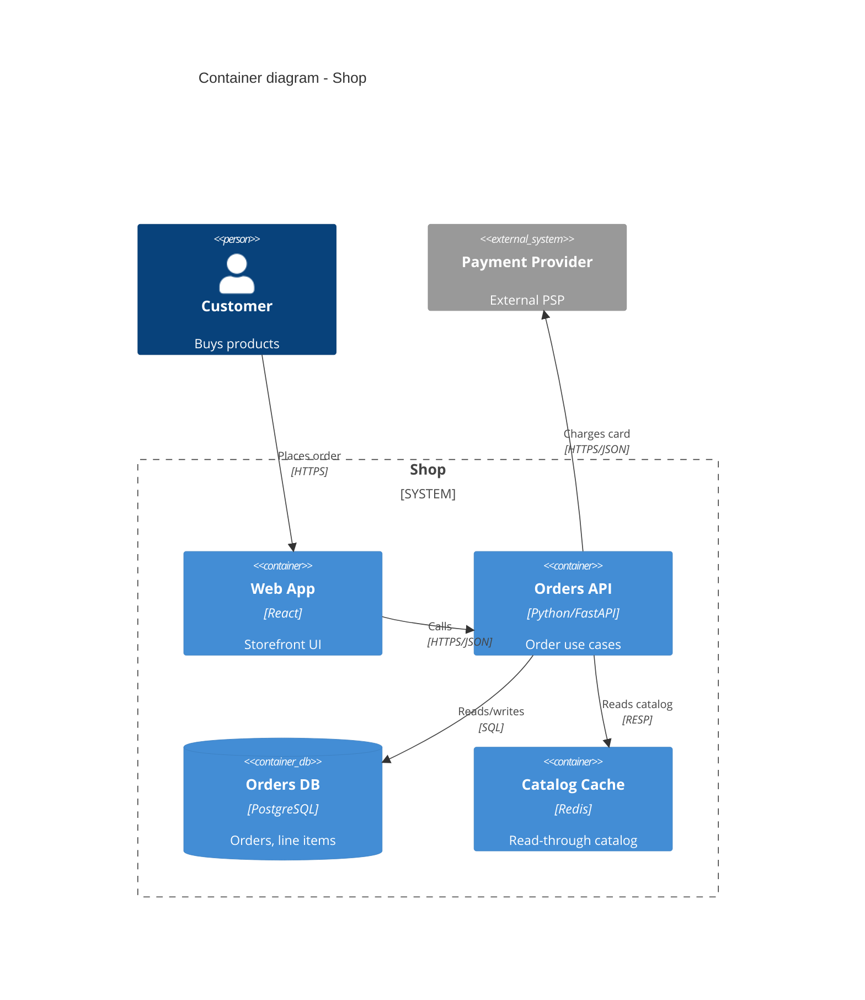

# C4 Model Diagrams

Model software at the four C4 zoom levels — System Context, Container, Component, Code — and keep every diagram as version-controlled text so it changes in the same pull request as the code it describes.

C4 (Simon Brown) names four levels after four C's and stops there. Do not invent extra levels.

## The four levels and when to draw each

1. System Context (Level 1) — the system as one box, surrounded by its users (personas) and the external systems it talks to. Audience: everyone, technical and not. Draw one per system; update it when an actor or external dependency is added or removed.
2. Container (Level 2) — the deployable/runnable units inside the system boundary: services, SPAs, mobile apps, databases, message brokers, serverless functions. Each container shows its technology and the protocol of every link (HTTPS/JSON, gRPC, AMQP, JDBC). This is the most useful level; spend the most effort here, and update it whenever a container is added or removed or a link's protocol or synchronicity changes.
3. Component (Level 3) — the major structural building blocks inside one container and their responsibilities. Draw it only for containers with real internal complexity; skip thin or generated ones, since the diagram would rot faster than it informs.
4. Code (Level 4) — class/ER detail. Generate it from code (IDE, tooling) rather than drawing it by hand; hand-drawn code diagrams are stale within a sprint.

The Container view is also the entry input to the `architecture_review_gate` and the place where new boundaries first appear before they get a design contract (`design_contracts_as_component_boundaries`).

## Notation discipline

- Every element has a name, a type, and a one-line responsibility. Every relationship has a verb-phrase label and a direction ("Sends order events to", not a bare arrow).
- Every dependency arrow names its protocol and synchronicity. Solid line for synchronous request/response, dashed for asynchronous/events. An unlabeled arrow is a defect.
- One diagram answers one question. If a Container diagram needs a legend longer than five entries, split it.
- Include a legend, a "last updated" date, and the author; a diagram with no date is assumed stale. Mark planned-but-not-built elements explicitly (a `[PLANNED]` tag) so readers do not mistake intent for reality.
- Keep shapes consistent per element type across all diagrams.

## Tooling: text, not drawings

Diagrams live in the repo as text and change in the same PR as the code. Three good options:

- Structurizr DSL — purpose-built for C4; one model renders all levels and stays consistent.

```
workspace {
  model {
    customer = person "Customer"
    shop = softwareSystem "Shop" {
      web = container "Web App" "React"
      api = container "Orders API" "Python/FastAPI"
      db = container "Orders DB" "PostgreSQL"
    }
    customer -> web "Places order via" "HTTPS"
    web -> api "Calls" "HTTPS/JSON"
    api -> db "Reads/writes" "SQL"
  }
}
```

- PlantUML with C4-PlantUML — a good fit if the team already runs PlantUML.
- Mermaid C4 — renders inline in GitHub/GitLab Markdown, the lowest friction for a pull request.

A binary export from a drawing tool is never the source of truth; it cannot be diffed or reviewed.

## Worked Container diagram (Mermaid C4)



Every box names its technology, every arrow names its protocol, the external PSP sits outside the system boundary, and the data store is shown explicitly. That is a Container diagram that passes review.

## Common pitfalls

- Mixing abstraction levels in one diagram (a class next to a load balancer), which makes the view unreadable; a reviewer rejects it because it answers no single question.
- Drawing the org chart or the team topology instead of the runtime structure; C4 models software, not people.
- Omitting the data stores, so the diagram hides where state lives and where most failure modes are.
- Unlabeled arrows or arrows with no protocol or synchronicity, which leave the integration semantics undefined.
- Hand-drawing the Code level or exporting binaries from a drawing tool, both of which rot and cannot be diffed in a PR.
- Drawing the aspirational system without marking what does not exist yet, so readers mistake intent for reality.
- Updating code structure without updating the Container view in the same PR, so the diagram lies.

## Definition of done

- [ ] System Context and Container diagrams exist as version-controlled text (Structurizr/PlantUML/Mermaid) and change in the same PR as the code.
- [ ] The Container view names each container's technology and the protocol and synchronicity of every link.
- [ ] Component diagrams are drawn only for containers with real internal complexity; the Code level is generated, not hand-drawn.
- [ ] Every element has a name, type, and one-line responsibility; every arrow has a verb-phrase label and a direction.
- [ ] Each diagram carries a legend, an author, and a last-updated date; planned elements are tagged.
- [ ] Data stores and external systems are shown explicitly, outside the system boundary where appropriate.
