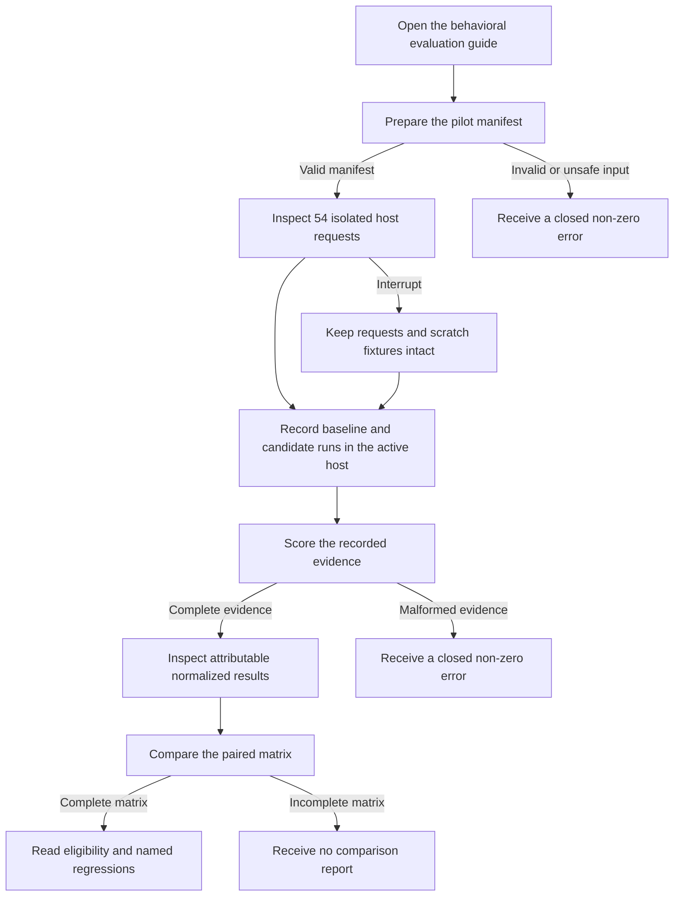

# J-01: Qualify a behavioral-evaluation candidate

An operator prepares isolated fixtures, records host-controlled runs, scores the
evidence, and compares the candidate with the baseline before deciding whether
the candidate is eligible for further review.



```yaml
id: J-01
name: Qualify a behavioral-evaluation candidate
value_statement: Decide from reproducible local evidence whether a candidate warrants further review.
personas:
  - Operator
entry_points:
  - docs/behavioral-evals.md
  - python -m solomon_harness.behavioral_evals prepare
actions:
  - action: Prepare the versioned manifest into a new scratch root.
    expected_observable: Exactly 54 unique requests point to bounded isolated fixtures.
  - action: Record each request with the active host and its containment policy.
    expected_observable: Every case arm and repetition has one attributable recording.
  - action: Score the complete recording artifact.
    expected_observable: Structural verdicts and nullable telemetry are emitted deterministically.
  - action: Compare the paired baseline and candidate results.
    expected_observable: Eligibility and each baseline-stable regression are named explicitly.
goal: Decide whether the candidate is eligible for later adoption work.
true_end_state: A persisted comparison report names the decision and regression evidence without changing protected project state.
exit: The operator retains the manifest recordings normalized results and comparison report for review.
abandonment:
  at_step: After preparation and before every host recording is complete.
  how: Stop the host run without invoking score or compare.
  resume: Continue from the persisted requests and create a complete recording artifact before scoring.
crosses:
  - Active host model execution boundary
```
