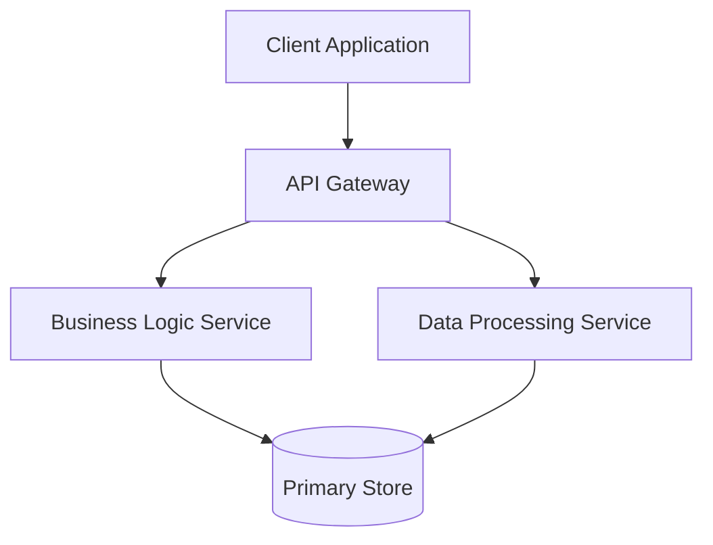

# Design Contract

## 1. Component Design
Describe the main software components, their boundaries, responsibilities, and modular configuration.

### System Components
- Component A: Description and responsibilities.
- Component B: Description and responsibilities.

## 2. C4 Architectural Block Diagram
Provide a high-level representation of system context, containers, or components using Mermaid syntax.



## 3. Data Flow Model
Detail the execution paths, message queues, state transitions, and database queries during operation.

- Step 1: Client initiates request.
- Step 2: Gateway validates token and routes request.
- Step 3: Service reads from data store and applies logic.

## 4. API Schemas
Define endpoints, request payloads, response structures, and HTTP status codes.

### POST /api/v1/resource
- Request:
  ```json
  {
    "id": "string",
    "value": 0.0
  }
  ```
- Response:
  ```json
  {
    "status": "success",
    "timestamp": "string"
  }
  ```

## 5. ADR Mappings
Map structural design choices to specific Architectural Decision Records (ADRs) stored in the codebase.
- Decision 101: Component modularization mapped to ADR-001.
- Decision 102: Data flow orchestration mapped to ADR-002.

## 6. Implementation Lifecycle
Detail branching and commits associated with the architectural rollout.
- Development Branch: feature/architecture-setup (branched from develop under Git Flow)
- Commit Strategy: Use Conventional Commits (e.g., refactor(arch): restructure gateway routes).
