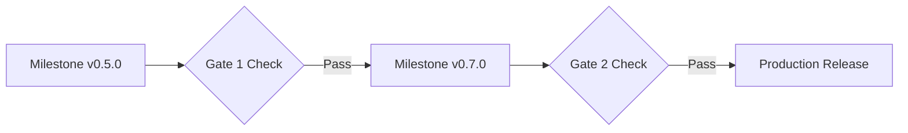

# Business Requirements Document (BRD)

This document outlines the business context, objectives, target personas, and validation metrics for **solomon-harness**.

---

## 1. Vision & Objectives

Provide a high-level summary of the business goals for solomon-harness:
* **Problem Statement:** Engineering teams face high cognitive load, context switches, and compliance drift when delivering software.
* **Core Objective:** Provide a cognitive automation engine that standardizes and automates SDLC tasks via specialized AI agents.
* **Stakeholder Value:** Drastically reduces cycle times, ensures 100% compliance with TDD and security standards, and preserves institutional memory.

---

## 2. Target Audience & User Personas

Identify the key users who interact with the system and their respective requirements:

| Persona | Core Pain Points | Target Outcome |
| --- | --- | --- |
| **Developer** | Spends too much time on manual testing, PR descriptions, and board updates. | Automates TDD cycles, PR creation, and status transitions, focusing on logic. |
| **Product Owner** | Writing stories, keeping the board clean, and tracking milestones is tedious. | Automatic issue creation and milestone-gated release tags. |
| **SRE / DevOps** | Risk of version drift and deploy failures due to manual steps. | Standardized Conventional Commits and automated release processes. |

---

## 3. Scope & Out of Scope

Clearly define the boundaries of the implementation to manage stakeholders' expectations:

### In Scope
* Multi-agent orchestration for standard software development tasks.
* Stateful memory storage using SurrealDB and SQLite.
* Automated release tag cutting and wiki synchronization.

### Out of Scope
* Publishing packages to PyPI (distributed as source tree tags).
* Running agents on external hosting platforms (runs locally via Claude Code/Gemini CLI).

---

## 4. Key Performance Indicators (KPIs)

To measure the success of the implementation, the system must meet these target thresholds:

* **Performance:** Workspace indexing in under 5 seconds for medium repos.
* **Reliability:** 100% fallback to SQLite if SurrealDB daemon is not active.
* **Business Metrics:** Developer time savings of over 20% on administrative overhead.

> [!NOTE]
> All KPIs must be verified by the QA and Observability agents using automated tests and Telemetry dashboards.

---

## 5. Roadmap & Release Gates

Detail the key milestones and validation gates before launching features to production:

