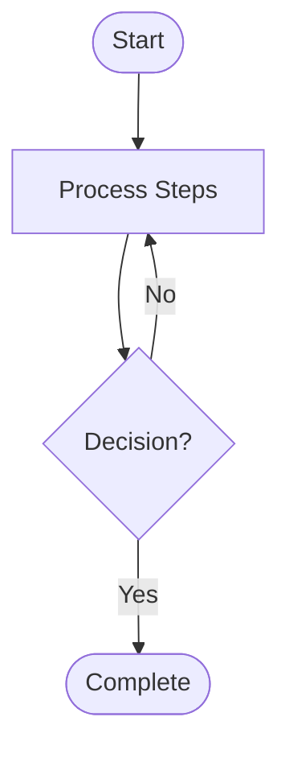

# Wiki Design System

This document defines the style guide, visual components, and formatting rules for the **solomon-harness** wiki. Following these guidelines ensures that all documentation remains clean, visually engaging, and highly professional.

---

## 1. Document Structure & Headings

Every page in the wiki must follow a consistent heading hierarchy:
* **H1 Title:** A single H1 header at the top of the page (e.g., `# Page Title`), followed immediately by a horizontal divider `---`.
* **H2 Subtitles:** Primary sections should use H2 (e.g., `## 1. Section Title`), followed by a single blank line.
* **H3 Subtitles:** Subsections should use H3 (e.g., `### Subsection Title`). Do not over-nest beyond H3.
* **Developer-First Navigation:** The main `Home.md` index directory must always list the **Quick Start Guide** and **Features** at the very top. This guarantees developers can immediately onboard and execute. Business objectives and technical references must follow below.

---

## 2. Listings & Lists

To avoid unformatted or cluttered text blocks, never use comma-separated lists for distinct items (e.g., instead of listing technologies as `Python, Javascript, Rust`, format them as lists).

### Unordered Lists
Use hyphens `-` for unordered bullet points:
- Bullet item A
- Bullet item B
  - Nested bullet item (indented by 2 spaces)

### Ordered Lists
Use numbers for sequential procedures:
1. First step
2. Second step
3. Third step

---

## 3. Tables

Tables must be cleanly aligned, with descriptive headers and proper markdown formatting.

| Element | Description | Target / Use Case |
| --- | --- | --- |
| **High** | Critical severity impact. | Production system failures. |
| **Medium** | Moderate severity impact. | Non-blocking feature bugs. |
| **Low** | Low severity impact. | Minor adjustments and styling. |

---

## 4. Visual Callouts & Color Codes

Use GitHub-style alert callouts to highlight important information, using color coding to guide the reader:

> [!NOTE]
> **Blue Callout:** Use for general background info, context, or neutral notes.

> [!TIP]
> **Green Callout:** Use for best practices, optimization advice, and productivity tips.

> [!IMPORTANT]
> **Purple Callout:** Use for crucial instructions, rules, or core requirements.

> [!WARNING]
> **Yellow Callout:** Use for warnings about deprecations, potential pitfalls, or configuration risks.

> [!CAUTION]
> **Red Callout:** Use for high-risk actions, security concerns, or operations that could result in data loss.

---

## 5. Diagramming (Mermaid)

Use Mermaid diagrams to visualize process flow, pipelines, or component architectures:

