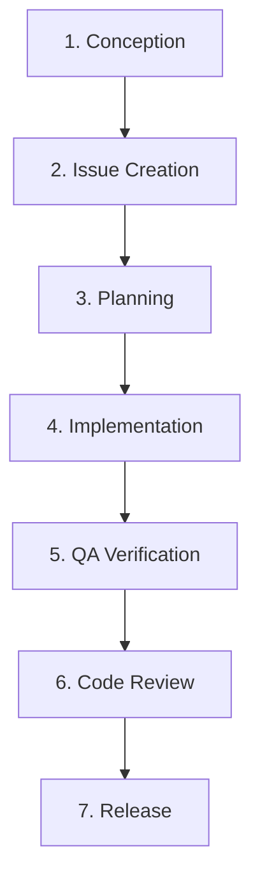

# Development Workflow

The Solomon Harness Agent operates under a structured, phased lifecycle to ensure maximum reliability and conformance to requirements. This guide describes the workflow from Conception to Release.

## Phase Breakdown

### 1. Conception (Planning & Hypotheses)
- **Goal:** Define high-level requirements, architectural designs, or quant model hypotheses.
- **Process:** The user and agents brainstorm initial ideas, formulating a clear hypothesis or requirement document. For quant tasks, this includes specifying targets, universe, inputs, and constraints.

### 2. Issue Creation (Scrum)
- **Goal:** Formulate trackable work items and milestones.
- **Process:** Issues are created using GitHub issue templates (`.github/ISSUE_TEMPLATE/`) to enforce structure.
  - Features use `01_feature_conception.md`.
  - Bugs use `02_bug_report.md`.
  - Quant/ML tasks use `03_quant_model_hypothesis.md`.
- Issue management is automated or simplified via `scripts/scrum-master.sh`.

### 3. Planning (Plan Write)
- **Goal:** Create a step-by-step implementation plan.
- **Process:** Write a plan detailing changes, target files, edge cases, and verification criteria before modifying any logic. This ensures clear intent and helps avoid implementation conflicts.

### 4. Implementation (TDD/Workflows)
- **Goal:** Author code and tests under Test-Driven Development (TDD) principles.
- **Process:** Follow the Red-Green-Refactor cycle:
  1. **Red:** Write failing tests matching the design contract.
  2. **Green:** Implement the minimum code required to make tests pass.
  3. **Refactor:** Clean up code while ensuring tests remain green.

### 5. QA Verification
- **Goal:** Validate functionality, reliability, and security.
- **Process:** Run automated test suites (unit, integration, and E2E), verify performance criteria, and run security scans. Verify against UAT checklist items outlined in the plan.

### 6. Code Review
- **Goal:** Verify code quality and design consistency.
- **Process:** Conduct automated PR analysis, check for dangerous API usage or regression risks, and generate standard commit messages.

### 7. Release
- **Goal:** Deploy or publish the working software/artifacts.
- **Process:** Merge the branch, sync wiki documentation via `scripts/wiki-sync.sh`, update milestones, and tag release versions.
