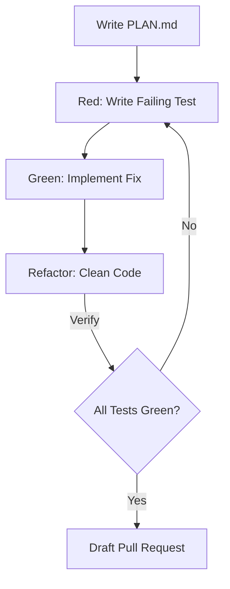

# Technical Overview & Feature Groups

Solomon Harness consolidates its 24 specialized AI agents and automation scripts into three core feature groups. These groups work together to provide developers and managers with a reliable, self-documenting development environment.

---

## 1. Autonomous Development Engine (TDD Command Center)

This feature group automates the implementation cycle, ensuring that code is written following strict Test-Driven Development (TDD) principles before integration.

### Core Capabilities
* **Structured Planning (`PLAN.md`):** Before writing code, the harness requires a detailed plan specifying affected files, edge cases, and verification criteria. This aligns intent and prevents regression.
* **TDD Implementation Loop (Red-Green-Refactor):** In automatic mode, the agent writes failing tests (Red), implements the minimal fix (Green), and cleans the implementation (Refactor).
* **Automated QA & Isolation:** Isolates tests by automatically mocking third-party integrations and external services.
* **Unified Command Loop (`/solomon-workflow`):** Scans the repository's board and memory to prompt and execute the next logical step, reducing command coordination.

### Direct User Power
> [!TIP]
> **Delegate with Confidence:** You can delegate complex bugs or feature tickets to the harness. Because it operates inside a sandboxed worktree and follows strict TDD, it will never submit code that fails existing test suites.

---

## 2. Stateful Project Memory & Context Preservation

This feature group prevents context degradation and ensures that AI agents have access to the history of the codebase, prior architectural decisions, and current work streams.

### Core Capabilities
* **Dual-Backend Storage:** Powered by SurrealDB for robust, structured graph queries locally, with a transparent SQLite fallback so that offline work or lack of a Docker daemon never blocks the developer.
* **Architectural Decision Records (ADRs):** Technical and business designs are stored in the memory layer. When planning new work, agents query previous ADRs to avoid architectural drift.
* **Tenancy Isolation:** Connects all projects on a machine to a single shared container but separates data cleanly into databases (tenants) derived from the git remote.
* **Codebase Indexing:** Extracts structure, dependencies, and file relationships into the database, allowing agents to route tasks to the correct modules.

| Feature | Primary Backend (SurrealDB) | Fallback Backend (SQLite) |
| --- | --- | --- |
| **Performance** | High (graph query support) | Standard (relational) |
| **Setup** | Docker container | Local file-based |
| **Data Separation** | Multi-tenant namespace | Per-project database file |
| **Telemetry** | Live WebSocket connections | Direct filesystem reads |

### Direct User Power
> [!NOTE]
> **Zero Context Re-Explanation:** Because agent sessions and decisions are persisted in the database memory, you do not need to re-paste context or re-explain past design decisions when starting a new session.

---

## 3. GitHub Integration & Release Engineering

This feature group connects the local development environment to GitHub, automating administrative overhead like board movement, PR writing, version bumping, and wiki updates.

### Core Capabilities
* **Kanban Board Automation:** Moves issues through columns (`Ideas` → `Backlog` → `Ready` → `In Progress` → `Code Review` → `QA` → `Done`) as the developer runs corresponding workflows.
* **SemVer Versioning & Changelogs:** Bumps project versions and generates `CHANGELOG.md` updates based on Conventional Commits, preventing version drift.
* **Fail-Closed Release Prep:** Releases are milestone-gated. A release is only triggered when a milestone reaches zero open issues and the prep PR passes CI checks.
* **Wiki Sync (`scripts/wiki-sync.sh`):** Copies local documentation files in `docs/wiki/` to the remote GitHub Wiki, ensuring the living documentation matches the latest main branch code.

### Direct User Power
> [!IMPORTANT]
> **Administrative Overhead Eliminated:** You no longer need to manually drag tickets on boards, write repetitive release notes, or copy-paste docs to the wiki. The delivery pipeline handles these tasks automatically upon branch merge and release.
