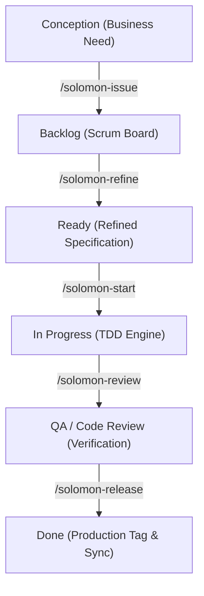

# Solomon Harness

This is the central knowledge base and business documentation portal for **solomon-harness**.

Rather than a simple AI chat interface, this project is configured as a **complete software development and automation harness**. By integrating a coordinated fleet of 24 specialized AI agents, interactive CLI commands (`/solomon-*`), stateful memory databases, and automated release gates, the harness manages the entire software development lifecycle (SDLC) while preserving strict architectural guidelines, security policies, and institutional memory.

---

## Business Value Proposition

The harness is structured to deliver clear, auditable business outcomes by optimizing the following core pillars:
* **High Development Velocity:** Translating requirement specifications directly into robust code implementations using an automated Test-Driven Development (TDD) engine.
* **Interactive SDLC Automation:** Automating administrative overhead (backlog refinement, QA checks, PR reviews, and wiki updates) via dedicated developer slash commands.
* **Zero-Drift Compliance & Security:** Enforcing strict, automated validation gates (TDD, linting, threat mitigations) before code can reach integration.
* **Institutional Memory Preservation:** Persisting all business goals, sessions, architectural decision records (ADRs), and sprint metrics in the database.

---

## Core Process Flow

The business value stream flows through a series of structured checkpoints, moving work seamlessly from concept to release:

## Documentation Index

Explore the structured documentation of the harness to understand its capabilities, usage, and release history:

* **[Quick Start Guide](Quick-Start)**
  Step-by-step instructions to verify prerequisites, install the CLI, configure the harness, and run your first automation loop.
* **[Commands Reference](Commands-Reference)**
  Detailed index of all `/solomon-*` commands, parameters, workflows, and orchestrations.
* **[Technical Overview](Features)**
  A deep dive into the technical feature groups that empower developers and stakeholders with autonomous coding, persistent memory, and release safety.
* **[Development Workflow](Development-Workflow)**
  Detailed view of the phased software delivery lifecycle, branch conventions, and TDD execution rules.
* **[Business Requirements](Business-Requirements)**
  Overview of business objectives, user personas, roadmap, and target key performance indicators (KPIs).
* **[Technical Documentation](Technical-Documentation)**
  System architecture overview, tech stack specifications, database schema, and API contracts.
* **[Living Code Overview](Code-Overview)**
  An automatically updated summary of the codebase structure, languages, files, and active specialist agents.
* **[Release History](Release-Notes)**
  Chronological log of release notes, tagged milestones, and delivered features.
* **[Wiki Design System](Design-System)**
  Formatting guidelines, tables style, callout colors, list conventions, and layouts.

> [!IMPORTANT]
> The Solomon Harness enforces a strict, trunk-based development model. All changes are squash-merged into `main`, and releases are milestone-gated to ensure production stability.
