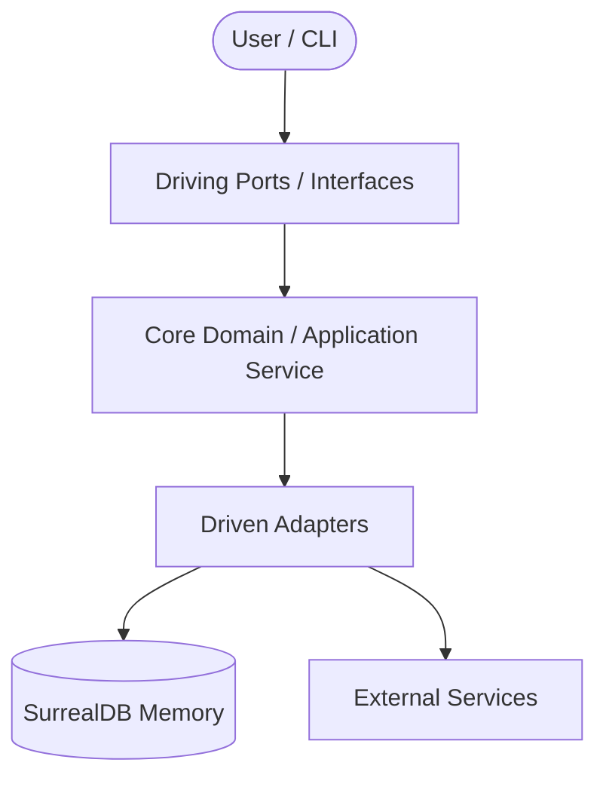

# Technical Documentation

This document describes the architectural patterns, technology stack, data models, and integration specifications for **solomon-harness**.

---

## 1. System Architecture

Describe the architectural pattern of solomon-harness (Hexagonal/Ports & Adapters).



---

## 2. Technology Stack

The project utilizes the following technologies for runtime execution, persistence, and telemetry:

* **Languages & Runtimes:**
  - JavaScript/TypeScript
  - Python
* **Database & Persistence:**
  - SurrealDB (Primary memory and graph knowledge store)
  - SQLite (Fallback file-based database for local testing and offline support)
* **Observability:** OpenTelemetry (Distributed tracing, metric gathering, and span analysis)

---

## 3. Database Schema & Data Models

Outline the primary data collections/tables, relations, and indexing strategies:

```
+------------------+         +------------------+
|     Session      |         |     Decision     |
+------------------+         +------------------+
| - id (UUID)      |<>------>| - id (UUID)      |
| - agent_name     |         | - title          |
| - context        |         | - context        |
+------------------+         +------------------+
```

---

## 4. Design Contracts & API Specifications

Specify interface definitions and communication protocols (e.g., OpenAPI specifications, Protocol Buffers, or strict type signatures).

> [!IMPORTANT]
> All interface changes require a corresponding plan review (`PLAN.md`) and must be verified to ensure no breaking changes occur to consumer services.

---

## 5. Development & Deployment Procedures

For instructions on building, running test suites, and executing local checks:
* Refer to **[CLAUDE.md](https://github.com/ortisan/solomon-harness/blob/main/CLAUDE.md)** for local testing commands and linters.
* Refer to **[Development Workflow Guide](Development-Workflow)** for detailed TDD and branching cycles.
